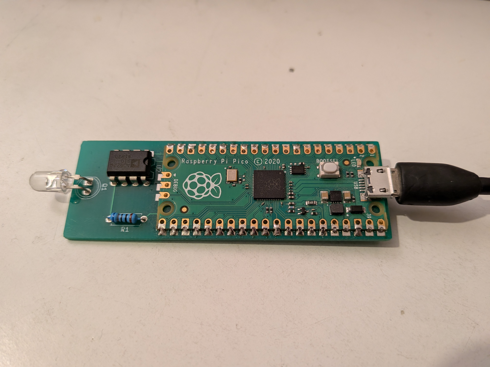
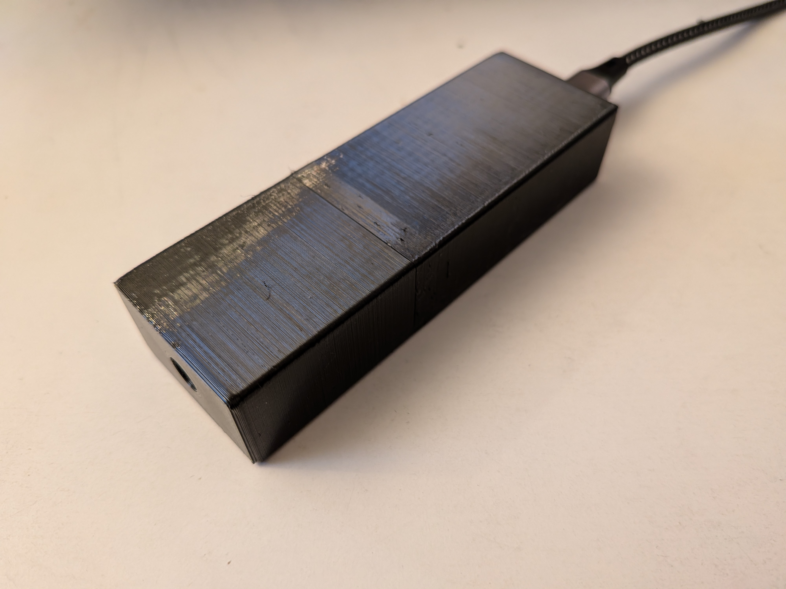

# Lighting flicker meter

This device measures the amount and speed of flicker in light sources and screens, using a phototransistor to measure the light and a Raspberry Pi Pico for signal processing.  It was designed to be cheap (less than £10 for parts in bulk, probably more like £30 to build just one) while still accurate enough to evaluate screens and lighting for those who are sensitive to flickering light.  (For information about the effects of flickering light, see e.g. [Lehman and Wilkins, 2014](https://visualstress.info/2014-220.pdf).)

## Circuit board
The PCB is a simple 2-layer layout, easily within the cheapest tier of JLCPCB or other manufacturers.  The KiCAD files are in the [pcb](pcb/) directory, along with all the output files needed to order your own PCBs.

There are only four things to solder on:
 * Raspberry Pi Pico.  This is surface-mounted on the PCB but the connections are big enough that it's quite doable by hand. I found it helped to use some 0.1" header pins to hold one side in the right place while soldering the other side.
 * 680Ω through-hole resistor.
 * AD5220BNZ10 digital potentiometer.  This costs more than the Raspberry Pi, but is rated for the current and is a through-hole part for easy soldering.  The marking on the PCB shows which way round to mount it.
 * SFH300 phototransistor.  This must also be soldered the right way round (the flat side should match the marking on the PCB) and at the right height so it's just above the PCB when the leads are bent over.



## Case
The 3D model for the case is in [case/case.3mf](case/case.3mf).  I printed mine in PETG at 0.15mm "quality" on a Prusa i3 MK3S printer.



## Firmware
The firmware that runs on the Pico is in [firmware/flicker-v1.0.uf2](firmware/flicker-v1.0.uf2).

### Installing the firmware
First connect the board by USB while holding the BOOTSEL button, which makes it appear as a USB-attached drive.  Then copy the .uf2 file to that drive.

### Building your own firmware
The firmware source is in the [firmware](firmware) directory.  If you want to build it yourself, you will need the [Raspberry Pi Pico SDK](https://github.com/raspberrypi/pico-sdk).  Once you have the SDK installed, you should be able to build the firmware using the Visual Studio Code extension as documented in the SDK.

## How to use
The flicker meter appears as a USB serial device.
* On Windows you can use [PuTTY](https://www.chiark.greenend.org.uk/~sgtatham/putty/latest.html).  Set the connection type to "Serial", the serial line to "COM3" (or check in Device Manager to see what COM number appears when you plug in the meter) and the speed to 115200.
* On Android you can use a serial terminal app such as [Serial USB Terminal](https://play.google.com/store/apps/details?id=de.kai_morich.serial_usb_terminal&hl=en_GB&pli=1).

Point the sensor at the light you want to measure.  It's usualy best to get quite close to the light it you can, unless you see a warning about it being too bright.  The measurements appear on the serial output, along with graphs of the frequency and waveform.  The graphs work best with a monospaced font and a window at least 80 characters wide.

E.g. measuring a CFL lightbulb:

```
AGC: 66/127
--------------------------------------------------------------------------------
                  *
                 * *
                 * *
                 * *
                *  *
                *   *
                *   *
                *   *
               *    *
               *    *
               *    *
              *      *
              *      *
              *      *
              *      *  *
********     *       *  ***
*       *    *        * * *
*        ****         * * * *
                       *  ** * ***                                             *
                           * ** ************************************************
--------------------------------------------------------------------------------
FFT: peak at 100.105042Hz
FFT: peak magnitude 376468.687500
--------------------------------------------------------------------------------
          *********************                    *****************
       *******           ************           *********     **************
*********                        *********** *****                      ********
  ****                                   ******                                *


--------------------------------------------------------------------------------
Raw samples: 19ms, 10% flicker.
```

The important numbers there are `10% flicker` (the amount by which the brightness varies over one cycle of the flickering) and `100Hz` (how fast it is flickering, in this case twice the 50Hz mains electricity frequency).

By contrast, a mobile phone screen using PWM for brightness control shows a faster but much deeper flicker:
```
AGC: 127/127 (TOO DARK)
--------------------------------------------------------------------------------
                          *
                          *
                          *
                          **     *
                          **     *
                          **     *
                          **     *   *
                         * *    **   *
                         * *    **   *
                         * *    **  **
                         * *    **  ** *
                         * *    **  ** **
                         * *    **  ** **
                         * *    **  ** **
                         * *    **  ** ****
                        *  *    **  ** ****
                        *   *   **  ** ****
                        *   *   * * ** *****
         ************   *   *   * * *  *** *  ****                             *
*********            ****    ****  ***** ***************************************
--------------------------------------------------------------------------------
FFT: peak at 239.751190Hz
FFT: peak magnitude 165692.468750
--------------------------------------------------------------------------------
**************************        *******************************         ******
                      ****        ********************************        ******
                         **      **                              *       **
                          *      *                               **      *
                          *      *                                *      *
                          *      *                                *      *
                          *     **                                *     **
                          **    *                                 **    *
                           *    *                                  *    *
                           *    *                                  *    *
                           *    *                                  *    *
                           **  **                                  **  **
                            *  *                                    *  *
                            ****                                    ****
                            ****                                    ****


--------------------------------------------------------------------------------
Raw samples: 8ms, 58% flicker.
```

## Limitations
It doesn't handle very bright or very dark sources, though it will warn about them being too bright or dark.  It tends to report flicker of >60KHz when in total darkness, which I assume is noise from the Pi Pico.

The phototransistor circuit is rather simple, based on my limited knowledge at the time, and the brightness compensation is a bit clunky.  I would like to redesign it at some point with a proper variable-gain amplifier and an antialiasing filter.

I haven't tried calibrating this meter or comparing it to a properly calibrated one.  Calibrated meters are rather expensive, which is why I built this in the first place.  If you have access to proper calibration equpment and would like to test one of these meters, get in touch! 